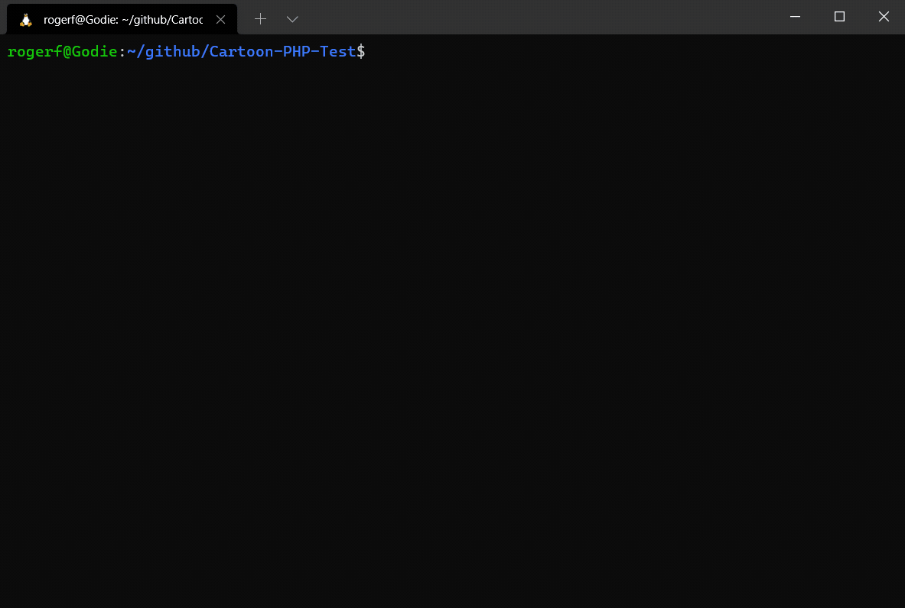

# Cartoon-PHP-Test

This is a test application for the Cartoon Cloud developer assesment test.
Please check out the [REQUIREMENTS](./REQUIREMENTS.md) file for the full test details.

| :memo:        | This is a work in progress |
|---------------|:---------------------------|

## Framework

This project is based on [Laravel Framework](https://laravel.com/) for PHP and developed using [VSCode](https://code.visualstudio.com/) on Windows 10 environment. You may run this on other OS by replacing as long as there is support for containers / alternative to Docker.

## Structure

The project is broken into to folders:

* The ``./packages/cartoon`` folder contains the required custom classes by the assessment. This is packaged as a local library using composer.
* The ``./test-app`` folder contains the implementation of the custom class based on Laravel.

## Requirements

This project on [devcontainers](https://code.visualstudio.com/docs/remote/containers) which allows replication of development environments, the following are requirements for running in Windows 10 environment.

* Install [Docker/Docker Desktop](https://www.docker.com/products/docker-desktop).
* Install [VSCode](https://code.visualstudio.com/).
* Install the [Remote Container Plugin](https://marketplace.visualstudio.com/items?itemName=ms-vscode-remote.remote-containers).
* Re-open this code in Remote Container or press ``CTRL+SHIFT+P`` then search and select ``Remote Containers: Open Folder in Container``.

Note: If you are using WSL2 see [documentation](https://docs.docker.com/desktop/windows/wsl/)

## Running

1. Open project in VSCode.
2. Re-open in devcontainer if prompted.
3. Open a new terminal window `` CTRL+SHIFT+` ``.
4. Run bash script as ``sh start.sh`` to start the developement server, you can press ``CTRL + C`` to stop.
5. Open a another terminal window `` CTRL+SHIFT+` `` and use the *curl* commands under *Testing* section.

## Manual Start using laravel artisan

1. Open VSCode terminal window `` CTRL+SHIFT+` ``.
2. Change to project directory: ``cd ./test-app``.
3. Install dependencies: ``composer install``.
4. Create the database: ``php artisan db:create``.
5. Initialize the Db tables: ``php artisan migrate``.
6. Insert test data: ``php artisan db:seed --class=UserSeeder``
7. Run the developement server: ``php artisan serve``

## Testing

You may use curl to test the API.

### GET /api/check

To check for authentication and connection:

``curl -u demo:pwd1234 -i -H 'Accept:application/json' http://localhost:8000/api/check``

### POST /api/test

To check output of test code and pass data:

``curl -u demo:pwd1234 -i -H 'Accept:application/json' -d '{"purchase_order_ids":[2344, 2345, 2346]}' -X POST http://localhost:8000/api/test``

Note: I made deviation on the API url to keep Laravel convention to serve api routes under ``/api`` prefix, else it can easily be moved to web routes.
